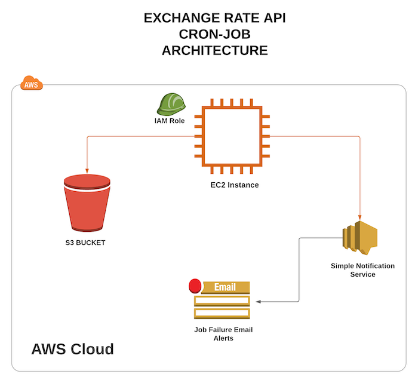
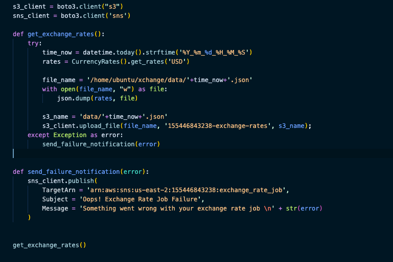
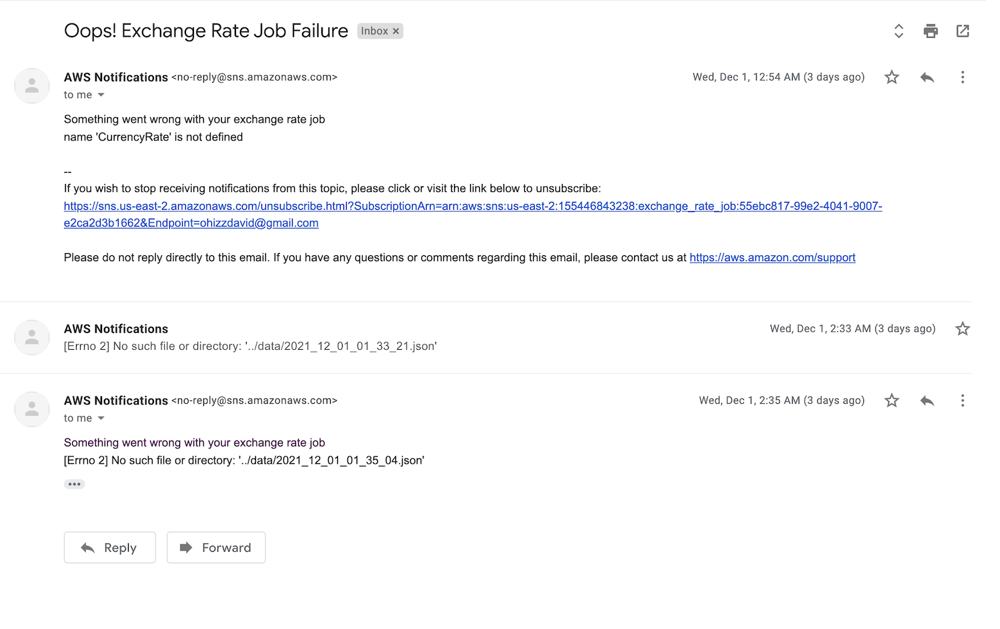

# Exchange Rate Job

#### **Architecture Diagram**

#### Problem Statement

I am starting an Exchange Company, and I want to get the rate at which exchange rate fluctuates from USD to (insert your currency of choice) I want to get and export of the excange rate as a JSON output every hour into an S3 bucket. I also want to be notified once this is completed or an error occurs.

## STEPS

#### Step 1
- Login to your Amazon Web Service Account

#### Step 2: Create EC2 Instance
This is responsible for running a python script that will generate exchange rates and write the output into a JSON file and send that JSON file into s3(this must be done hourly)

- In your AWS account, search for EC2
- On the EC2 Dashboard select Launch Instance
- Select appropriate configuration parameters to setup instance
- SSH into new instance with selected SSH keypairs
- Create new directory to hold project files
- Create python script to fetch exchange rates and push json files to an s3 bucket.

#### Step 3: Create IAM Role
- Assign IAM Role that would let your EC2 instance write files to S3 and trigger email notifications from SNS

#### Step 4: SNS Notification

* AWS Simple Notification Service(SNS), we will be sending a job failure or job success notification to the exchange team each time I successfully write into the bucket or each time the jobs fails.

#### Step 5: Setup up Topic Subscription for Job Failure Error Alerts 

